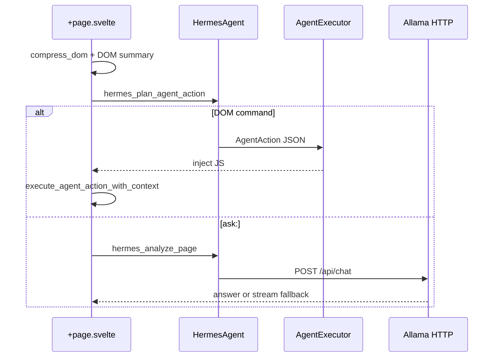

# AI, Inference, and Hermes Integration

**English** · [中文版](./AI_HERMES_INTEGRATION.zh-CN.md)

## Unified stack

| Layer | Component | Role |
|-------|-----------|------|
| Process | **Allama** (`ai_port`, default 11435) | Local GGUF inference (Ollama-compatible HTTP) |
| Rust | **InferenceEngine** | Model registry; routes to Allama HTTP or embedded stub gateway |
| Rust | **HermesAgent** | Task/strategy layer; Analysis tasks call Allama via `AllamaHttpClient` |
| UI | **Sidebar AI** | `allamaClient.ts` — direct HTTP streaming |
| UI | **Agent panel** | `hermes_analyze_page` → Hermes → Allama; fallback to `streamSidebarChat` |

Legacy **exodus-core** sidecar (optional) shares `ai_port` — only one listener per port.

## Agent panel flow (linked)



## Tauri commands

| Command | Purpose |
|---------|---------|
| `hermes_plan_agent_action` | Map scroll/links/JSON → `AgentAction` for DOM executor |
| `hermes_run_agent_command` | Create Automation task + return `actionJson` |
| `hermes_analyze_page` | Page Q&A with DOM context (preferred agent path) |
| `hermes_run_strategy_steps` | Run multi-step templates without saving a strategy id |
| `hermes_create_strategy` / `hermes_execute_strategy` | Persisted strategy API |
| `hermes_plan_automation_steps` | Allama JSON plan → DOM steps (`plan: …` in agent input) |
| `hermes_create_task` / `hermes_execute_task` | Low-level task API |
| `get_ai_config` / `set_ai_config` | Port/model; syncs Hermes + InferenceEngine |
| `allama_service_*` | Start/stop native Allama |
| `inference_*` | Registry API (no UI wiring yet) |

## Frontend

- `src/lib/hermesClient.ts` — `hermesAnalyzePage()`, `hermesPlanAgentAction()`, `hermesRunStrategySteps()`
- `src/lib/hermesStrategies.ts` — built-in templates (Page scan, Page audit AI, Quick scroll)
- Agent panel: **Strategy** dropdown + **Run strategy**; **Save…** writes custom templates to `localStorage` (`exodus.hermes.strategy.templates`)
- Settings → **Inference engine (Rust)**: `inference_*` registry UI (`src/lib/inferenceClient.ts`, `InferenceEngineSettings.svelte`)
- `src/lib/sidebarAiChat.ts` — streaming fallback
- `src/lib/aiConfig.ts` — shared port/model

## Tests

```bash
pnpm test:ai-hermes      # Allama + inference + Hermes + Vitest
sh scripts/test-allama.sh
```

Rust: `allama_stack_test::hermes_analyze_page_calls_allama_http`, `hermes_agent::test_analyze_page_*`

## Related

- [ALLAMA_INTEGRATION.md](../ALLAMA_INTEGRATION.md)
- [EXTENSIONS_DEV.md](./EXTENSIONS_DEV.md) — `window.exodus.allama`
