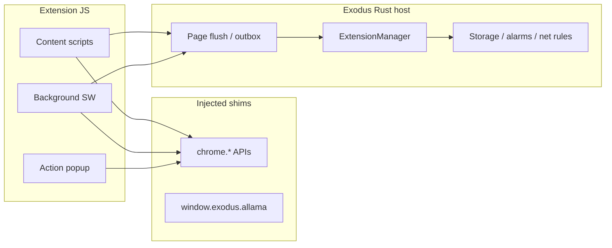

# Exodus Web Extension Developer Guide

**Audience:** Extension authors targeting the Exodus Browser (Tauri) Web Extension bridge.  
**Compatibility:** Chrome Extension **Manifest V3** (subset). Not a full Chrome/Chromium extension host.  
**Status:** Production MVP with automated quality gates — see [PLUGIN_SYSTEM_AUDIT.md](../PLUGIN_SYSTEM_AUDIT.md) for host-side gaps.  
**中文版：** [EXTENSIONS_DEV.zh-CN.md](./EXTENSIONS_DEV.zh-CN.md)

---

## Table of contents

1. [Quick start](#quick-start)
2. [Project layout](#project-layout)
3. [Manifest V3 requirements](#manifest-v3-requirements)
4. [Extension ID and URLs](#extension-id-and-urls)
5. [Installation and development workflow](#installation-and-development-workflow)
6. [Architecture overview](#architecture-overview)
7. [Supported Chrome APIs](#supported-chrome-apis)
8. [Exodus-specific APIs](#exodus-specific-apis)
9. [Host permissions and site access](#host-permissions-and-site-access)
10. [Source quality conventions](#source-quality-conventions)
11. [Bundled sample extensions](#bundled-sample-extensions)
12. [Automated testing](#automated-testing)
13. [Limitations and roadmap](#limitations-and-roadmap)
14. [Related documentation](#related-documentation)

---

## Quick start

1. Clone the Exodus repo and install dependencies (`pnpm install`).
2. Create a folder under `extensions/my-extension/` with at least:

```text
extensions/my-extension/
├── manifest.json
└── background.js          # and/or content scripts
```

3. Minimal **background-only** manifest:

```json
{
  "manifest_version": 3,
  "name": "My Extension",
  "version": "1.0.0",
  "description": "Short description in English.",
  "permissions": ["storage"],
  "background": {
    "service_worker": "background.js"
  }
}
```

4. Run the validator and Rust integration tests:

```bash
pnpm test:extensions
```

5. Run the browser — dev builds **auto-scan** `extensions/`:

```bash
pnpm tauri dev
```

6. Open **Settings → Web Extensions**, confirm your extension appears, enable it, and test.

---

## Project layout

| Path | Purpose |
|------|---------|
| `extensions/` | Unpacked dev samples; scanned automatically when running from a dev build |
| `src-tauri/src/plugins/` | Host: manifest parse, injection, Chrome shims, storage, alarms, webRequest, DNR |
| `src-tauri/src/plugins/chrome_bridge.rs` | Injected `chrome.*` and `window.exodus.allama` shims |
| `src/lib/extensions/` | Frontend: settings UI, tab sync, permission prompts |
| `scripts/validate-dev-extensions.mjs` | Node validator (manifest, syntax, quality bar) |
| `scripts/test-dev-extensions.sh` | Full extension test entrypoint |

**Installed extensions** (after install from folder/CRX) live under the app data directory (`plugins/web-extensions/<id>/`), not in the repo `extensions/` folder.

---

## Manifest V3 requirements

Exodus validates manifests at load time (`src-tauri/src/plugins/manifest.rs`).

| Rule | Detail |
|------|--------|
| `manifest_version` | Must be **3** (MV2 rejected) |
| `name`, `version` | Required, non-empty |
| Scripts | At least one of: **content_scripts** (with non-empty `matches`) **or** `background.service_worker` |
| `background.service_worker` | Non-empty path to a `.js` file that exists on disk |
| Content script assets | Every path in `js` / `css` must exist |
| `action.default_popup` | If set, HTML/JS paths must exist |

### Supported manifest fields (subset)

```json
{
  "manifest_version": 3,
  "name": "string",
  "version": "semver-like string",
  "description": "optional",
  "permissions": ["storage", "tabs", "..."],
  "host_permissions": ["https://example.com/*"],
  "content_scripts": [{
    "matches": ["https://*/*"],
    "exclude_matches": ["*://localhost/*"],
    "js": ["content.js"],
    "css": ["content.css"],
    "run_at": "document_start | document_end | document_idle",
    "all_frames": true
  }],
  "background": { "service_worker": "background.js" },
  "action": {
    "default_title": "Tooltip",
    "default_popup": "popup.html"
  }
}
```

### `run_at` injection timing

| Value | When injected |
|-------|----------------|
| `document_start` | Before DOM is ready (default for many samples) |
| `document_end` | After DOM, before `load` |
| `document_idle` | Default if omitted |

### Match patterns

Uses Exodus match-pattern logic (`src-tauri/src/plugins/match_patterns.rs`). Supports common Chrome patterns such as `<all_urls>`, `http://*/*`, `https://*/*`, and host wildcards. URLs `about:` and `data:` are **never** matched.

---

## Extension ID and URLs

- **Extension ID** = sanitized **folder name** (e.g. `sample-hello` → id `sample-hello`).
- **Popup / extension pages:** `extension://<id>/<relative-path>`

Examples:

```text
extension://sample-hello/popup.html
chrome.runtime.getURL('popup.html')  →  extension://<id>/popup.html
```

Resolved to `file://` under the extension install directory with path-traversal protection (`extension_url.rs`).

---

## Installation and development workflow

### Dev folder (recommended)

Place unpacked source in `extensions/<id>/`. On startup, the host calls `dev_extensions_dir()` → `<repo>/extensions` and loads every subdirectory.

### UI installation

**Settings → Web Extensions**

- **Install from folder** — copy/register unpacked extension
- **Rescan** — reload dev + installed extensions
- **Enable / disable** per extension
- **Site access** — revoke or confirm `host_permissions`
- **Install-time host confirmation** — optional prompt queue (see sample `test-host-perms-a` / `b`)

### CRX / ZIP packages

`.crx` / zip install is supported via `install_from_crx` (see optional CI test with `EXODUS_TEST_CRX_PATH` in README).

### Background service worker host

MV3 `background.service_worker` runs inside a hidden host webview (`exodus-ext-bg-<id>`), not a separate OS process. Boot script = injected prelude + your `background.js` wrapped in try/catch.

---

## Architecture overview



1. **Prelude injection** — Before your script runs, the host injects storage seed, tab list, and permission-gated `chrome.*` shims.
2. **Outbox flush** — API calls queue operations (`__exodusRuntimeOutbox`, `__exodusTabOpsOutbox`, etc.); the browser flushes them to Rust on a timer/navigation.
3. **Persistence** — `chrome.storage.local` is backed by on-disk storage per extension ID.
4. **Messaging** — `runtime.sendMessage` / `tabs.sendMessage` route through the host to background or content listeners.

---

## Supported Chrome APIs

Permissions in `manifest.json` **gate** which shims are injected. Unknown permission strings are ignored.

| Permission | APIs (MVP) | Notes |
|------------|------------|--------|
| `storage` | `chrome.storage.local` get/set/remove | Persisted; session storage available host-side |
| `tabs` | `query`, `update`, `remove`, `reload`, `get`, `getCurrent`, `move`, `duplicate`, `goBack`, `goForward`, `detectLanguage`, `captureVisibleTab` | Full implementation via TabRegistry (captureVisibleTab requires screenshot API integration) + unit tests |
| `activeTab` | Tab access for active tab context | Combined with tabs shim |
| `scripting` | `chrome.scripting.executeScript` | Also implied when `content_scripts` present |
| `notifications` | `create`, `update`, `clear`, `getAll` | Host UI integration |
| `alarms` | `create`, `get`, `getAll`, `clear`, `clearAll`, `onAlarm` | Persisted; fired via host scheduler |
| `declarativeNetRequest` | `updateDynamicRules` | URL filter block/redirect at navigation |
| `webRequest` | `onBeforeRequest`, `onBeforeSendHeaders`, `onHeadersReceived`, `onSendHeaders`, `onResponseStarted`, `onBeforeRedirect`, `onCompleted`, `onErrorOccurred` | Full implementation via WebRequestManager + unit tests |
| `bookmarks` | `getTree`, `getChildren`, `getRecent`, `search`, `create`, `update`, `move`, `remove`, `removeTree` | Full implementation via `BookmarkSyncManager` + unit tests |
| `history` | `search`, `addUrl`, `deleteUrl`, `deleteAll`, `getUrl` | Full implementation via `HistoryManager` + unit tests |
| `downloads` | `search`, `pause`, `resume`, `cancel`, `getItem`, `removeFile`, `erase`, `open`, `show`, `showDefaultFolder`, `setUiOptions` | Full implementation via `DownloadManager` + unit tests |
| `topSites` | `get`, `getWithOptions` | Full implementation via `HistoryManager.get_most_visited()` + unit tests |
| `sessions` | `getRecentlyClosed`, `getDevices`, `restore` | Full implementation via `SessionRegistry` (restore returns URL for frontend to open) + unit tests |
| `cookies` | `get`, `getAll`, `set`, `remove` | Full implementation via `CookieManager` + unit tests |
| `management` | `get`, `getAll`, `getSelf`, `setEnabled` | Full implementation via `ExtensionManager` (getSelf requires caller context) + unit tests |
| `contextMenus` | `create`, `update`, `remove`, `removeAll`, `getAll`, `listHost`, `onClicked` | Full implementation via `ContextMenuRegistry` + unit tests |
| `webNavigation` | `getFrame`, `getAllFrames` | Full implementation via `WebNavigationRegistry` + unit tests |
| `sidePanel` | `setOptions`, `getOptions`, `setPanelBehavior`, `getPanelBehavior` | Placeholder implementation (requires UI integration) |
| `identity` | `getAuthToken`, `getProfileUserInfo`, `removeCachedAuthToken` | Placeholder implementation (requires OAuth provider integration) |
| *(always)* | `chrome.action` setTitle, setBadgeText, setBadgeBackgroundColor, openPopup | `browserAction` alias |
| *(always)* | `chrome.permissions` contains, getAll, request | `request` may return false until UI prompt is complete |
| *(background)* | `chrome.runtime.onMessage`, `tabs.sendMessage`, `getPlatformInfo` | |
| *(content/popup)* | `chrome.runtime.sendMessage`, `getURL`, `getManifest`, `onMessage` | |

### Runtime

| API | Support |
|-----|---------|
| `chrome.runtime.id` | Yes |
| `chrome.runtime.getURL(path)` | Yes → `extension://` |
| `chrome.runtime.getManifest()` | Yes |
| `chrome.runtime.getPlatformInfo()` | Background |
| `chrome.runtime.onInstalled` | Listener registration; host may auto-fire on install |
| `chrome.runtime.onSuspend` | Tracked host-side |
| `chrome.runtime.sendMessage` / `onMessage` | Yes (async via outbox) |
| `chrome.runtime.onUpdateAvailable` | Not implemented |
| `chrome.runtime.requestUpdateCheck` | Not implemented |

### Not implemented (use alternatives)

| Chrome API | Alternative in Exodus |
|------------|----------------------|
| `chrome.contextMenus` | Available (placeholder) |
| `chrome.omnibox` | Available (placeholder) |
| `chrome.devtools` | Not available |
| `chrome.sidePanel` | Available (placeholder) |
| `chrome.bookmarks` | Available (placeholder) |
| `chrome.history` | Available (placeholder) |
| `chrome.downloads` | Available (placeholder) |
| `chrome.topSites` | Available (placeholder) |
| `chrome.sessions` | Available (placeholder) |
| `chrome.identity` | Available (placeholder) |
| `chrome.cookies` | Available (placeholder) |
| `chrome.management` | Available (placeholder) |
| `chrome.tabs.executeScript` | `content_scripts` or `scripting.executeScript` |
| Persistent background page | MV3 service worker only |

For a full host audit checklist see [PLUGIN_SYSTEM_AUDIT.md](../PLUGIN_SYSTEM_AUDIT.md).

---

## Exodus-specific APIs

### `window.exodus.allama`

Injected into **all** extension contexts (content, background, popup) when the prelude loads. Talks to the local Allama HTTP sidecar (default port **11435**).

| Method | Description |
|--------|-------------|
| `health()` | `GET /api/tags` liveness |
| `chat(messages, model?)` | Non-streaming chat |
| `generate(prompt, model?)` | Completion |
| `embed(text, model?)` | Embedding vector |
| `streamChat(messages, model?, callbacks)` | SSE streaming to `onChunk` / `onDone` / `onError` |

Example (content script or background):

```javascript
(function () {
  'use strict';
  const allama = window.exodus && window.exodus.allama;
  if (!allama) return;
  allama.health().then(function (ok) {
    console.debug('[my-ext] allama', ok);
  });
})();
```

TypeScript helpers for browser UI code (not injected into extensions): `src/lib/extensions/exodusAllama.ts`.

**Privacy note:** Allama runs locally; prompts do not leave the machine unless you explicitly call remote URLs.

---

## Host permissions and site access

Declare broad or site-specific access:

```json
"host_permissions": ["https://example.com/*", "<all_urls>"]
```

Exodus enforces host access separately from API permissions:

- **Install-time prompts** — When “Ask before granting extension site access on install” is enabled, each extension’s hosts can be confirmed in order (hand-test: `test-host-perms-a`, `test-host-perms-b`).
- **Site access UI** — Revoke all host access per extension; navigation to those hosts is blocked until re-granted.
- **Browser site permissions** (camera / mic / geolocation) are **browser-level**, not extension-level — see Settings → Privacy & memory.

---

## Source quality conventions

Bundled samples and CI enforce an **aerospace-grade** bar for `extensions/`:

| Requirement | Rationale |
|-------------|-----------|
| File header `/** ... */` on every `.js` / `.css` | Traceability, reviewability |
| `'use strict'` in all JS | Safer extension code |
| `tsLog()` or `LOG_PREFIX` + `toISOString()` | Timestamped lifecycle logs |
| Defensive API guards | Check `chrome.runtime.lastError`; wrap calls in try/catch |
| English menu strings and descriptions | Project convention |
| Popup HTML `lang="en"` | Accessibility |

Run before every commit that touches `extensions/`:

```bash
pnpm test:extensions
```

This runs:

1. **Node** — `scripts/validate-dev-extensions.mjs` (manifest, assets, `node --check`, conventions)
2. **Rust** — `dev_extensions_tests` (load, inject markers, permission contracts)

---

## Bundled sample extensions

| Folder | Purpose |
|--------|---------|
| `sample-hello` | Reference: storage, tabs, runtime messaging, alarms, notifications, action badge, CSS marker, popup dashboard |
| `sample-all-frames` | `all_frames: true` + CSS for top vs iframe |
| `sample-net-rules` | `declarativeNetRequest` + `webRequest` blocking **only** `exodus-blocked.test` |
| `test-host-perms-a` | Host permission install prompt (`example-a.test`) |
| `test-host-perms-b` | Second host prompt (`example-b.test`) |

### Hand-test checklist

1. **sample-hello** — Open `https://example.com`; purple outline; console logs; popup shows storage; badge `OK`.
2. **sample-all-frames** — Page with same-origin iframe; green outline on top frame, yellow on iframe.
3. **sample-net-rules** — Navigate to `https://exodus-blocked.test/` → blocked (fake host).
4. **host perms** — Enable install prompts; install A then B; dialogs show **extension names**.

---

## Automated testing

```bash
# Extension-only (fast)
pnpm test:extensions

# Full repo verify (includes extensions)
pnpm verify
```

### Adding tests for your extension

1. Place the extension under `extensions/<your-id>/`.
2. Re-run `pnpm test:extensions` — validators pick up new folders automatically.
3. For behavioral contracts (inject markers, permissions), add a test in `src-tauri/src/plugins/dev_extensions_tests.rs` following existing `sample_*` tests.

### Optional CRX signature test

```bash
EXODUS_TEST_CRX_PATH=/path/to/extension.crx \
  cargo test -p exodus-tauri verify_real_webstore_crx_when_env_set -- --ignored
```

---

## Limitations and roadmap

| Area | Current behavior |
|------|------------------|
| Process model | Extensions share the browser process (no separate renderer sandbox) |
| Hot reload | Requires rescan / restart |
| Updates | Manual reinstall; no Web Store auto-update |
| `chrome.permissions.request` | Placeholder / partial UI |
| Tab `update` / `remove` / `reload` | Registry + events; full tab control coordination in progress |
| MV2 | Not supported |
| Chrome API surface | Subset only — test on Exodus, not Chrome |

High-priority host work is tracked in [PLUGIN_SYSTEM_AUDIT.md](../PLUGIN_SYSTEM_AUDIT.md) (tabs coordination, permission request UI, webRequest lifecycle events).

---

## Related documentation

- [README.md](../README.md) — Web Extensions section, quick commands
- [README.zh-CN.md](../README.zh-CN.md) — 中文 Web 扩展说明
- [PLUGIN_SYSTEM_ARCHITECTURE.md](../PLUGIN_SYSTEM_ARCHITECTURE.md) — Hybrid plugin design
- [PLUGIN_SYSTEM_AUDIT.md](../PLUGIN_SYSTEM_AUDIT.md) — API matrix and gaps
- [ALLAMA_INTEGRATION.md](../ALLAMA_INTEGRATION.md) — Local LLM sidecar
- [HTTP_RESPONSE_PROXY.md](./HTTP_RESPONSE_PROXY.md) — webRequest header proxy details

---

*Last updated: 2026-05-21 — aligns with `extensions/` samples v1.0–1.1 and `dev_extensions_tests`.*
