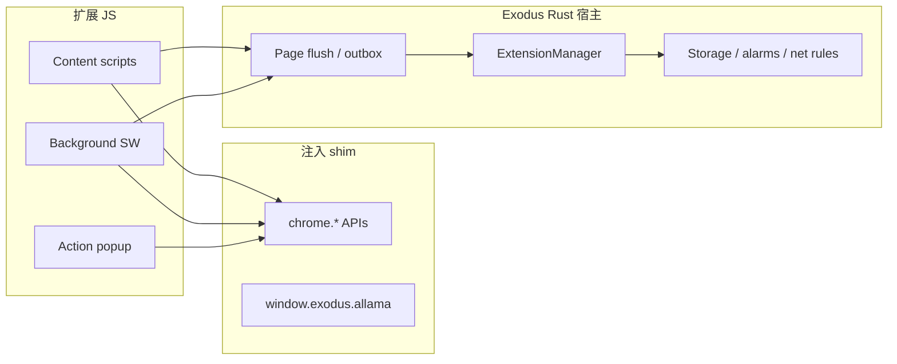

# Exodus Web 扩展开发者指南

**读者：** 面向 Exodus Browser（Tauri）Web 扩展桥的扩展作者。  
**兼容性：** Chrome Extension **Manifest V3**（子集）。**不是**完整的 Chrome/Chromium 扩展宿主。  
**状态：** 生产可用 MVP，带自动化质量门禁 — 宿主侧缺口见 [PLUGIN_SYSTEM_AUDIT.md](../PLUGIN_SYSTEM_AUDIT.md)。  
**英文版：** [EXTENSIONS_DEV.md](./EXTENSIONS_DEV.md)

---

## 目录

1. [快速开始](#快速开始)
2. [项目结构](#项目结构)
3. [Manifest V3 要求](#manifest-v3-要求)
4. [扩展 ID 与 URL](#扩展-id-与-url)
5. [安装与开发流程](#安装与开发流程)
6. [架构概览](#架构概览)
7. [支持的 Chrome API](#支持的-chrome-api)
8. [Exodus 专有 API](#exodus-专有-api)
9. [主机权限与站点访问](#主机权限与站点访问)
10. [源码质量规范](#源码质量规范)
11. [内置样例扩展](#内置样例扩展)
12. [自动化测试](#自动化测试)
13. [限制与路线图](#限制与路线图)
14. [相关文档](#相关文档)

---

## 快速开始

1. 克隆 Exodus 仓库并安装依赖：`pnpm install`。
2. 在 `extensions/my-extension/` 下创建目录，至少包含：

```text
extensions/my-extension/
├── manifest.json
└── background.js          # 和/或 content scripts
```

3. 最小 **仅后台** manifest 示例：

```json
{
  "manifest_version": 3,
  "name": "My Extension",
  "version": "1.0.0",
  "description": "Short description in English.",
  "permissions": ["storage"],
  "background": {
    "service_worker": "background.js"
  }
}
```

> **说明：** `name`、`description` 等面向用户的文案建议用英文（项目约定）；代码注释与菜单字符串也使用英文。

4. 运行校验与 Rust 集成测试：

```bash
pnpm test:extensions
```

5. 启动浏览器 — 开发构建会**自动扫描** `extensions/`：

```bash
pnpm tauri dev
```

6. 打开 **设置 → Web Extensions（Web 扩展）**，确认扩展出现、启用并测试。

---

## 项目结构

| 路径 | 用途 |
|------|------|
| `extensions/` | 未打包的开发样例；`pnpm tauri dev` 时自动扫描 |
| `src-tauri/src/plugins/` | 宿主：manifest 解析、注入、Chrome shim、storage、alarms、webRequest、DNR |
| `src-tauri/src/plugins/chrome_bridge.rs` | 注入 `chrome.*` 与 `window.exodus.allama` |
| `src/lib/extensions/` | 前端：设置页、标签同步、权限弹窗 |
| `scripts/validate-dev-extensions.mjs` | Node 校验（manifest、语法、质量门禁） |
| `scripts/test-dev-extensions.sh` | 扩展测试入口脚本 |

**已安装的扩展**（从文件夹/CRX 安装后）位于应用数据目录 `plugins/web-extensions/<id>/`，**不在**仓库的 `extensions/` 下。

---

## Manifest V3 要求

Exodus 在加载时校验 manifest（`src-tauri/src/plugins/manifest.rs`）。

| 规则 | 说明 |
|------|------|
| `manifest_version` | 必须为 **3**（拒绝 MV2） |
| `name`、`version` | 必填且非空 |
| 脚本 | 至少具备其一：**content_scripts**（`matches` 非空）或 **background.service_worker** |
| `background.service_worker` | 非空路径，且对应 `.js` 文件存在 |
| 内容脚本资源 | `js` / `css` 中列出的文件必须存在 |
| `action.default_popup` | 若配置，HTML/JS 路径必须存在 |

### 支持的 manifest 字段（子集）

```json
{
  "manifest_version": 3,
  "name": "string",
  "version": "semver-like string",
  "description": "optional",
  "permissions": ["storage", "tabs", "..."],
  "host_permissions": ["https://example.com/*"],
  "content_scripts": [{
    "matches": ["https://*/*"],
    "exclude_matches": ["*://localhost/*"],
    "js": ["content.js"],
    "css": ["content.css"],
    "run_at": "document_start | document_end | document_idle",
    "all_frames": true
  }],
  "background": { "service_worker": "background.js" },
  "action": {
    "default_title": "Tooltip",
    "default_popup": "popup.html"
  }
}
```

### `run_at` 注入时机

| 值 | 注入时机 |
|----|----------|
| `document_start` | DOM 就绪之前（多数样例默认） |
| `document_end` | DOM 之后、`load` 之前 |
| `document_idle` | 省略时的默认值 |

### 匹配模式（match patterns）

使用 Exodus 匹配逻辑（`src-tauri/src/plugins/match_patterns.rs`）。支持常见 Chrome 模式，如 `<all_urls>`、`http://*/*`、`https://*/*` 及主机通配。`about:` 与 `data:` URL **永远不会**匹配。

---

## 扩展 ID 与 URL

- **扩展 ID** = 经消毒的**文件夹名**（例如 `sample-hello` → id `sample-hello`）。
- **弹窗 / 扩展页：** `extension://<id>/<相对路径>`

示例：

```text
extension://sample-hello/popup.html
chrome.runtime.getURL('popup.html')  →  extension://<id>/popup.html
```

解析为安装目录下的 `file://`，并防止路径穿越（`extension_url.rs`）。

---

## 安装与开发流程

### 开发目录（推荐）

将未打包源码放在 `extensions/<id>/`。启动时宿主通过 `dev_extensions_dir()` 指向 `<仓库>/extensions`，并加载每个子目录。

### 通过设置页安装

**Settings → Web Extensions**

| 操作 | 说明 |
|------|------|
| Install from folder | 从文件夹复制/注册未打包扩展 |
| Rescan | 重新加载开发目录 + 已安装扩展 |
| Enable / disable | 按扩展开关 |
| Site access | 撤销或确认 `host_permissions` |
| Install-time host confirmation | 可选：安装时按队列确认主机权限（样例 `test-host-perms-a` / `b`） |

### CRX / ZIP 包

支持通过 `install_from_crx` 安装 `.crx` / zip（可选 CI 测试见 README 中的 `EXODUS_TEST_CRX_PATH`）。

### 后台 Service Worker 宿主

MV3 的 `background.service_worker` 运行在隐藏宿主 webview（`exodus-ext-bg-<id>`）中，**不是**独立 OS 进程。启动脚本 = 注入 prelude + 你的 `background.js`（外层 try/catch 包裹）。

---

## 架构概览



1. **Prelude 注入** — 脚本执行前，宿主注入 storage 种子、标签列表、按权限门控的 `chrome.*` shim。
2. **Outbox 刷新** — API 调用写入队列（`__exodusRuntimeOutbox`、`__exodusTabOpsOutbox` 等）；浏览器定时/导航时刷新到 Rust。
3. **持久化** — `chrome.storage.local` 按扩展 ID 落盘。
4. **消息** — `runtime.sendMessage` / `tabs.sendMessage` 经宿主路由到后台或 content 监听器。

---

## 支持的 Chrome API

`manifest.json` 中的 **permissions** 决定注入哪些 shim；未知权限字符串会被忽略。

| 权限 | API（MVP） | 备注 |
|------|------------|------|
| `storage` | `chrome.storage.local` get/set/remove | 持久化；session storage 在宿主侧可用 |
| `tabs` | `query`、`create`、`sendMessage`、`update`、`remove`、`reload`、`get`、`getCurrent`、`move`、`duplicate`、`goBack`、`goForward`、`detectLanguage`、`captureVisibleTab` | 部分标签操作为**占位**（发事件；完整浏览器联动进行中） |
| `activeTab` | 当前标签上下文 | 与 tabs shim 组合 |
| `scripting` | `chrome.scripting.executeScript` | 声明 `content_scripts` 时也会隐含 |
| `notifications` | `create`、`update`、`clear`、`getAll` | 与宿主 UI 集成 |
| `alarms` | `create`、`get`、`getAll`、`clear`、`clearAll`、`onAlarm` | 持久化；由宿主调度触发 |
| `declarativeNetRequest` | `updateDynamicRules` | 导航时按 URL 过滤 block/redirect |
| `webRequest` | `onBeforeRequest`、`onBeforeSendHeaders`、`onHeadersReceived`（blocking 子集） | `onCompleted` / `onErrorOccurred` 为空操作 |
| *（始终）* | `chrome.action` setTitle、setBadgeText、setBadgeBackgroundColor、openPopup | `browserAction` 别名 |
| *（始终）* | `chrome.permissions` contains、getAll、request | `request` 在 UI 完成前可能返回 false |
| *（background）* | `chrome.runtime.onMessage`、`tabs.sendMessage`、`getPlatformInfo` | |
| *（content/popup）* | `chrome.runtime.sendMessage`、`getURL`、`getManifest`、`onMessage` | |

### Runtime

| API | 支持情况 |
|-----|----------|
| `chrome.runtime.id` | ✅ |
| `chrome.runtime.getURL(path)` | ✅ → `extension://` |
| `chrome.runtime.getManifest()` | ✅ |
| `chrome.runtime.getPlatformInfo()` | ✅（后台） |
| `chrome.runtime.onInstalled` | 可注册监听；宿主可能在安装时自动触发 |
| `chrome.runtime.onSuspend` | 宿主侧跟踪 |
| `chrome.runtime.sendMessage` / `onMessage` | ✅（经 outbox 异步） |
| `chrome.runtime.onUpdateAvailable` | ❌ 未实现 |
| `chrome.runtime.requestUpdateCheck` | ❌ 未实现 |

### 未实现（请用替代方案）

| Chrome API | Exodus 替代 |
|------------|-------------|
| `chrome.contextMenus` | 不可用 |
| `chrome.omnibox` | 不可用 |
| `chrome.devtools` | 不可用 |
| `chrome.sidePanel` | 不可用 |
| `chrome.tabs.executeScript` | 使用 `content_scripts` 或 `scripting.executeScript` |
| 持久后台页 | 仅 MV3 service worker |

完整宿主审计清单见 [PLUGIN_SYSTEM_AUDIT.md](../PLUGIN_SYSTEM_AUDIT.md)。

---

## Exodus 专有 API

### `window.exodus.allama`

在 prelude 加载时注入到**所有**扩展上下文（content、background、popup）。通过本地 Allama HTTP Sidecar 通信（默认端口 **11435**）。

| 方法 | 说明 |
|------|------|
| `health()` | `GET /api/tags` 存活检测 |
| `chat(messages, model?)` | 非流式对话 |
| `generate(prompt, model?)` | 文本补全 |
| `embed(text, model?)` | 嵌入向量 |
| `streamChat(messages, model?, callbacks)` | SSE 流式，`onChunk` / `onDone` / `onError` |

示例（content 或 background）：

```javascript
(function () {
  'use strict';
  const allama = window.exodus && window.exodus.allama;
  if (!allama) return;
  allama.health().then(function (ok) {
    console.debug('[my-ext] allama', ok);
  });
})();
```

浏览器 UI 的 TypeScript 辅助（**不会**注入扩展内）：`src/lib/extensions/exodusAllama.ts`。

**隐私说明：** Allama 在本地运行；除非你主动请求远程 URL，提示词不会离开本机。

---

## 主机权限与站点访问

在 manifest 中声明广义或站点级访问：

```json
"host_permissions": ["https://example.com/*", "<all_urls>"]
```

Exodus 将 **API 权限** 与 **主机访问** 分开 enforcement：

- **安装时确认** — 开启「安装时询问是否授予扩展站点访问」后，可按顺序确认各扩展的主机（手测：`test-host-perms-a`、`test-host-perms-b`）。
- **Site access UI** — 可按扩展撤销全部主机访问；撤销后访问这些主机会被拦截，直至重新授予。
- **浏览器站点权限**（摄像头 / 麦克风 / 地理位置）属于**浏览器级**，非扩展级 — 见 **Settings → Privacy & memory → Site permissions**。

---

## 源码质量规范

内置样例与 CI 对 `extensions/` 执行**航空航天级**门禁：

| 要求 | 原因 |
|------|------|
| 每个 `.js` / `.css` 有文件头 `/** ... */` | 可追溯、可审查 |
| 所有 JS 使用 `'use strict'` | 更安全 |
| `tsLog()` 或 `LOG_PREFIX` + `toISOString()` | 带时间戳的生命周期日志 |
| 防御式 API 调用 | 检查 `chrome.runtime.lastError`；try/catch 包裹 |
| 菜单与描述使用英文 | 项目约定 |
| Popup HTML 设置 `lang="en"` | 无障碍 |

每次修改 `extensions/` 后提交前运行：

```bash
pnpm test:extensions
```

包含：

1. **Node** — `scripts/validate-dev-extensions.mjs`（manifest、资源、`node --check`、规范）
2. **Rust** — `dev_extensions_tests`（加载、注入标记、权限契约）

---

## 内置样例扩展

| 目录 | 用途 |
|------|------|
| `sample-hello` | 参考实现：storage、tabs、runtime 消息、alarms、notifications、徽章、CSS 标记、popup 面板 |
| `sample-all-frames` | `all_frames: true` + 顶栏/iframe CSS 区分 |
| `sample-net-rules` | `declarativeNetRequest` + `webRequest`，**仅**拦截假域名 `exodus-blocked.test` |
| `test-host-perms-a` | 安装时主机权限弹窗（`example-a.test`） |
| `test-host-perms-b` | 第二个主机权限弹窗（`example-b.test`） |

### 手测清单

1. **sample-hello** — 打开 `https://example.com`；淡紫描边；控制台日志；popup 显示 storage；徽章 `OK`。
2. **sample-all-frames** — 含同源 iframe 的页面；顶栏绿框、iframe 黄框。
3. **sample-net-rules** — 访问 `https://exodus-blocked.test/` → 应被拦截（假域名，不影响真实站点）。
4. **host perms** — 开启安装确认；依次安装 A、B；对话框应显示**扩展名称**而非 id。

---

## 自动化测试

```bash
# 仅扩展（较快）
pnpm test:extensions

# 全仓库 verify（含扩展）
pnpm verify
```

### 为你的扩展增加测试

1. 将扩展放在 `extensions/<your-id>/`。
2. 重新运行 `pnpm test:extensions` — 校验器会自动发现新目录。
3. 若需行为契约（注入标记、权限等），在 `src-tauri/src/plugins/dev_extensions_tests.rs` 中参照现有 `sample_*` 测试添加用例。

### 可选 CRX 签名校验

```bash
EXODUS_TEST_CRX_PATH=/path/to/extension.crx \
  cargo test -p exodus-tauri verify_real_webstore_crx_when_env_set -- --ignored
```

---

## 限制与路线图

| 领域 | 当前行为 |
|------|----------|
| 进程模型 | 扩展与浏览器共享进程（无独立渲染沙箱） |
| 热重载 | 需 Rescan / 重启 |
| 更新 | 手动重装；无 Web Store 自动更新 |
| `chrome.permissions.request` | 占位 / 部分 UI |
| 标签 `update` / `remove` / `reload` | 注册表 + 事件；完整标签控制联动进行中 |
| MV2 | 不支持 |
| Chrome API 面 | 仅为子集 — 请在 Exodus 上测试，勿假设与 Chrome 一致 |

高优先级宿主工作见 [PLUGIN_SYSTEM_AUDIT.md](../PLUGIN_SYSTEM_AUDIT.md)（标签联动、权限请求 UI、webRequest 生命周期事件等）。

---

## 相关文档

- [EXTENSIONS_DEV.md](./EXTENSIONS_DEV.md) — 英文开发者指南（与本文件同步）
- [README.md](../README.md) — Web 扩展小节与命令
- [README.zh-CN.md](../README.zh-CN.md) — 中文项目说明
- [PLUGIN_SYSTEM_ARCHITECTURE.md](../PLUGIN_SYSTEM_ARCHITECTURE.md) — 混合插件架构
- [PLUGIN_SYSTEM_AUDIT.md](../PLUGIN_SYSTEM_AUDIT.md) — API 矩阵与缺口
- [ALLAMA_INTEGRATION.md](../ALLAMA_INTEGRATION.md) — 本地 LLM Sidecar
- [HTTP_RESPONSE_PROXY.md](./HTTP_RESPONSE_PROXY.md) — webRequest 头代理细节

---

*最后更新：2026-05-21 — 与 `extensions/` 样例 v1.0–1.1 及 `dev_extensions_tests` 对齐。*
